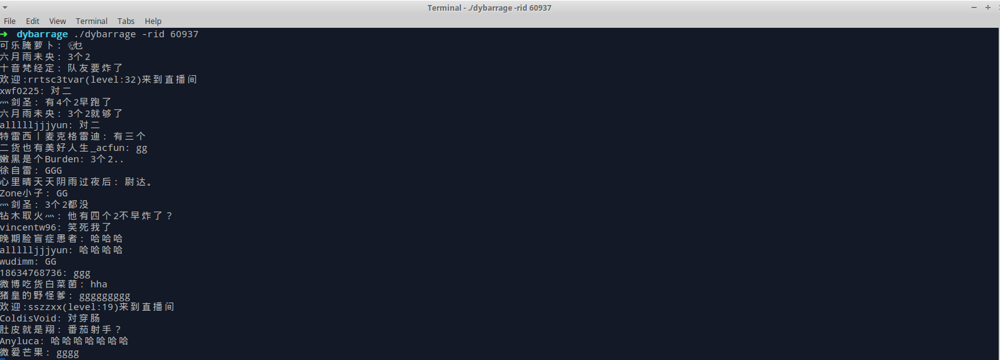

# DouyuBarrage
======================   

A tool that gets Douyu barrages and show them on standard output.

Install
--------------

    go get -u -x github.com/Katsusan/DouyuBarrage

Usage
---------------------

    dybarrage [options]

currently only entrance message and chat message will be shown.

Options
---------------

- `-rid` room id in Douyu. such as : if stream url is "https://douyu.com/97376", then room id will be 97376, default is 9999.

- `-u` mysql user, default: root

- `-p` mysql password, default: none

- `-h` mysql server ip, default: 127.0.0.1

- `-port` mysql listening port, default: 3306

- `-d` mysql database name. default: dybarrage

- `-c` default char set for connection. default: utf8

Examples
---------------

Get barrages from douyu.com/60937.

    dybarrage -rid 60937

Get barrages from douyu.com/9999 and storing them in mysql.

    dybarrage -rid 9999 -u <user> -p <password> -h <server_ip> -port <server_port> -d <database_name> -c <charset>

Any questions please contact evergonuaa@gmail.com.

Snapshot
---------------

TODOs
---------------

- Support more messages shown(such as gifts).
- Support more ways of display.(such as GUI)

Related Project
---------------

A douyu barrage tool(python) also here. [https://github.com/rieuse/DouyuTV](https://github.com/rieuse/DouyuTV)

License
---------------

This package is licensed under MIT license. See LICENSE for details.